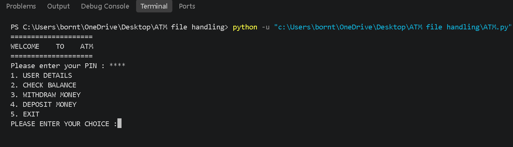
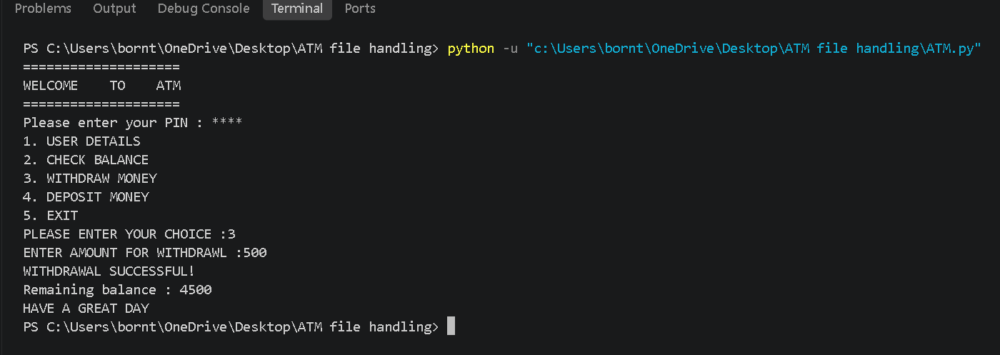
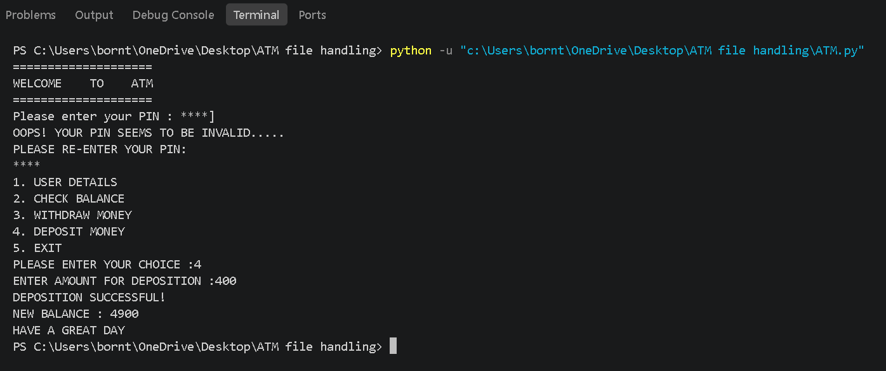

# 🏧 ATM Program — File Handling Update

This is an updated version of my original **Python ATM Program**.

In this update, I added **file handling** so that the ATM can save and load the account balance even after the program is closed.

## 🆕 What's New?

### 📁 File Handling

Previously, the balance was directly stored in the Python program:

```python
balance = 5000
```

Now, the balance is stored in a separate `balance.txt` file.

The program reads the balance when it starts and saves the updated balance after a withdrawal or deposit.

This means the balance **no longer resets when the program is closed**.

## ✨ Features

* 🔐 PIN authentication
* 👤 User details
* 💰 Check balance
* 💸 Withdraw money
* 💵 Deposit money
* 📁 Persistent balance using file handling

## 🔄 How File Handling Works

### When the program starts:

```text
balance.txt
     ↓
Read balance
     ↓
Convert text to integer
     ↓
Use balance in ATM
```

### After a withdrawal or deposit:

```text
Updated balance
     ↓
Convert integer to text
     ↓
Write balance to balance.txt
```

## 🛠️ Technologies Used

* Python
* File Handling
* Conditional Statements
* User Input

## 📂 Project Files

```text
ATM File Handling/
├── ATM.py
├── balance.txt
└── README.md
```

## 📸 Screenshots

### Main Menu



### Withdrawal



### Deposit




## 📚 What I Learned

While updating this project, I learned how to:

* Open files using `open()`
* Read files using `read()`
* Write files using `write()`
* Convert strings to integers using `int()`
* Convert integers to strings using `str()`
* Store data permanently using a text file

## 🚀 Project Status

**Updated with File Handling ✅**

This is the latest version of my ATM program. I will continue improving it as I learn more Python.

## 👨‍💻 Author

**Aashish Luitel**

Part of my Python learning journey.
